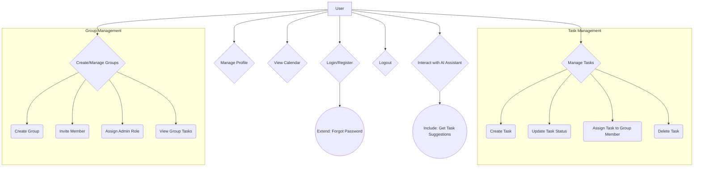
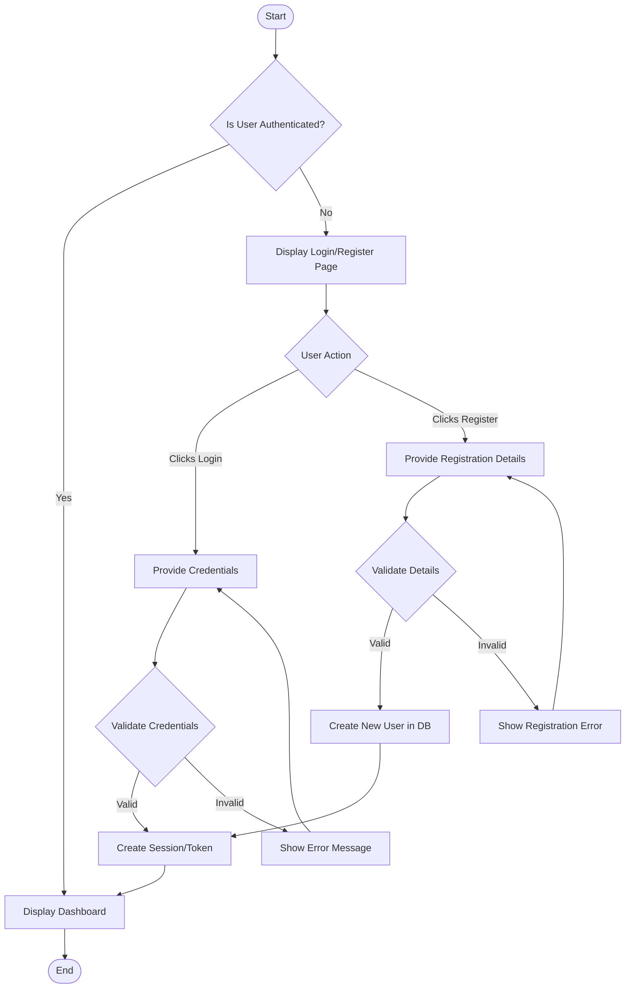
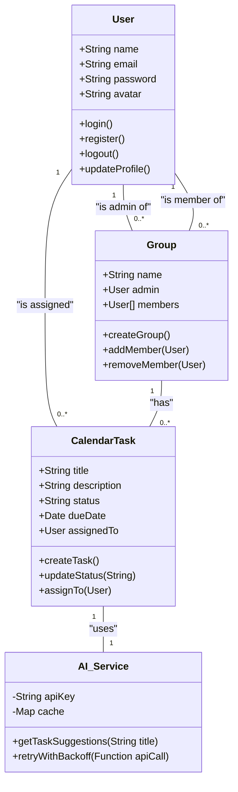
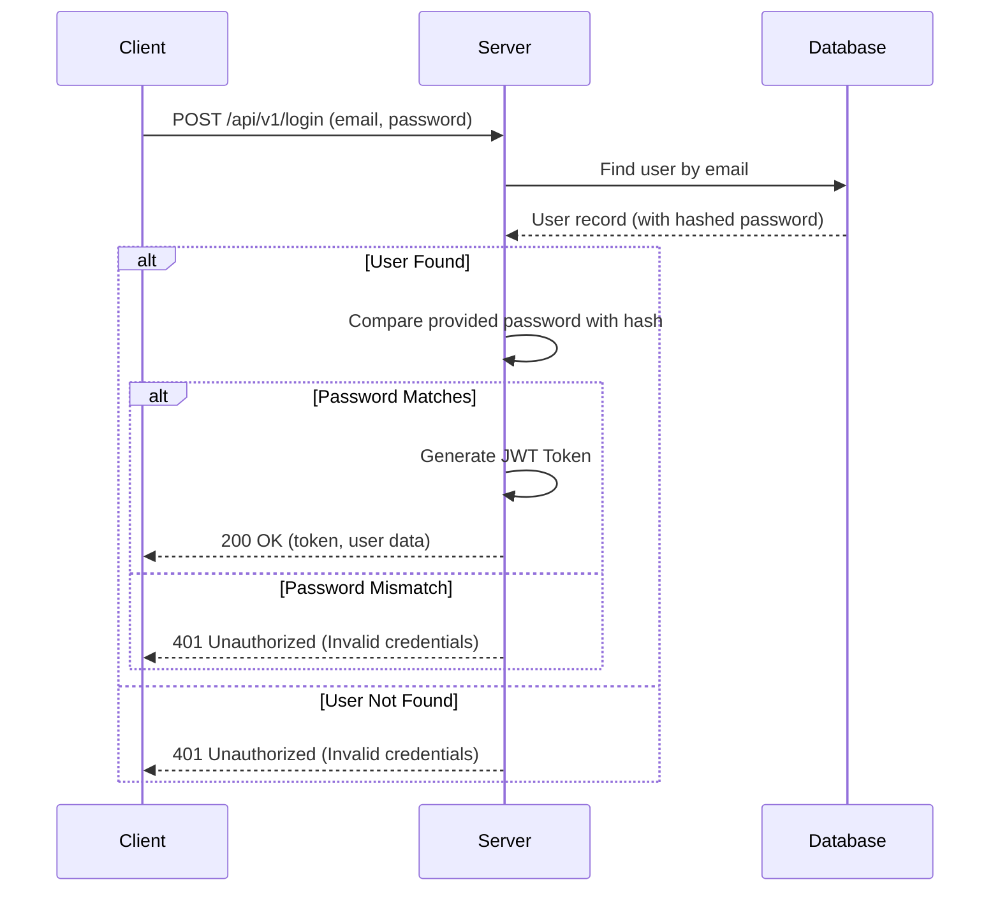
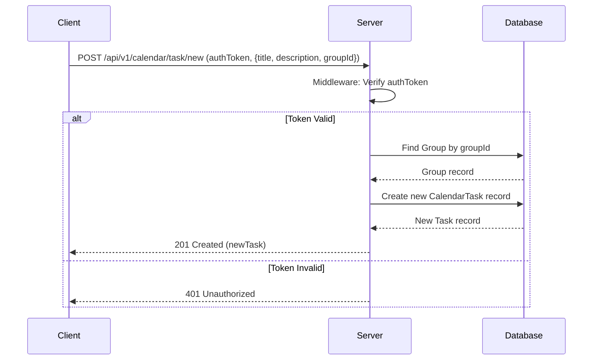

# UML Diagrams for the Authentication Project

This file contains the visual UML diagrams for the project, generated using Mermaid syntax. To view them, open the command palette (`Ctrl+Shift+P`) and select **Markdown: Open Preview to the Side**.

## 1. Use Case Diagram

This diagram shows the interactions between the user (Actor) and the main features of the system.



## 2. Activity Diagrams

### User Authentication Flow

This diagram illustrates the step-by-step process for user login and registration.



### AI Task Suggestion Flow

This diagram shows the logic for fetching AI-powered task suggestions, including caching and error handling.

```mermaid
graph TD
    start([Start]) --> user_typing[User types in task title];
    user_typing --> debounce{Debounce Input (300ms)};
    debounce --> check_cache{Check In-Memory Cache for Title};
    check_cache -- Found --> get_from_cache[Get Suggestions from Cache];
    get_from_cache --> display_suggestions[Display AI Suggestions];
    check_cache -- Not Found --> call_api[Call Gemini API];
    call_api --> api_response{API Response};
    api_response -- Success (200) --> parse_response[Parse Suggestions];
    parse_response --> store_in_cache[Store in Cache];
    store_in_cache --> display_suggestions;
    api_response -- Overloaded (503) --> retry_logic{Initiate Exponential Backoff};
    retry_logic --> wait_1s[Wait 1s];
    wait_1s --> call_api_again[Call API (Attempt 2)];
    call_api_again -- Still 503 --> wait_2s[Wait 2s];
    wait_2s --> call_api_final[Call API (Attempt 3)];
    call_api_final -- Failure --> show_error[Show Network Error to User];
    show_error --> stop([End]);
    display_suggestions --> stop;
```

## 3. Class Diagram

This diagram represents the main data models (classes) and their relationships.



## 4. Sequence Diagrams

### User Login Sequence

This diagram shows the sequence of interactions when a user logs in.



### Create Group Task Sequence

This diagram illustrates the process of a user creating a new task within a group.


